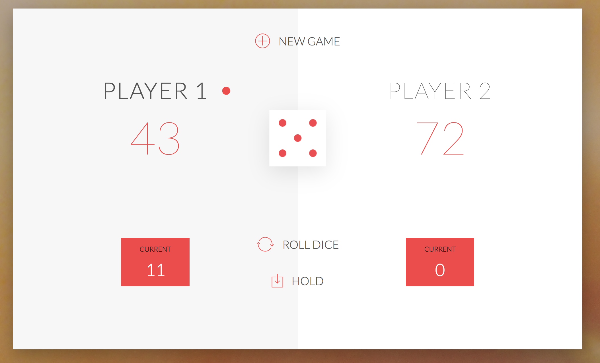

# :game_die: DICE GAME :game_die:
---

####  :confetti_ball: RÈGLES :confetti_ball::

* Le jeu a 2 joueurs, jouant chacun leur tour
* À chaque tour, un joueur lance un dés autant de fois qu'il souhaite. Chaque résultat est ajouté à son score `ROUND`.
* MAIS, si le joueur roule le dès et qu'il fait 1,  son score `ROUND` se perd. Après cela, c'est le tour du prochain joueur
* Le joueur peut choisir 'Hold', ce qui signifie que son `ROUND` est ajouté au score `GLOBAL`. Après cela, c'est le tour du prochain joueur.
* Le premier joueur à atteindre 100 points sur `GLOBAL` gagne le jeu.
---